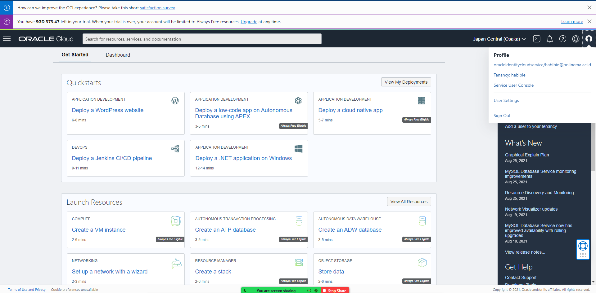
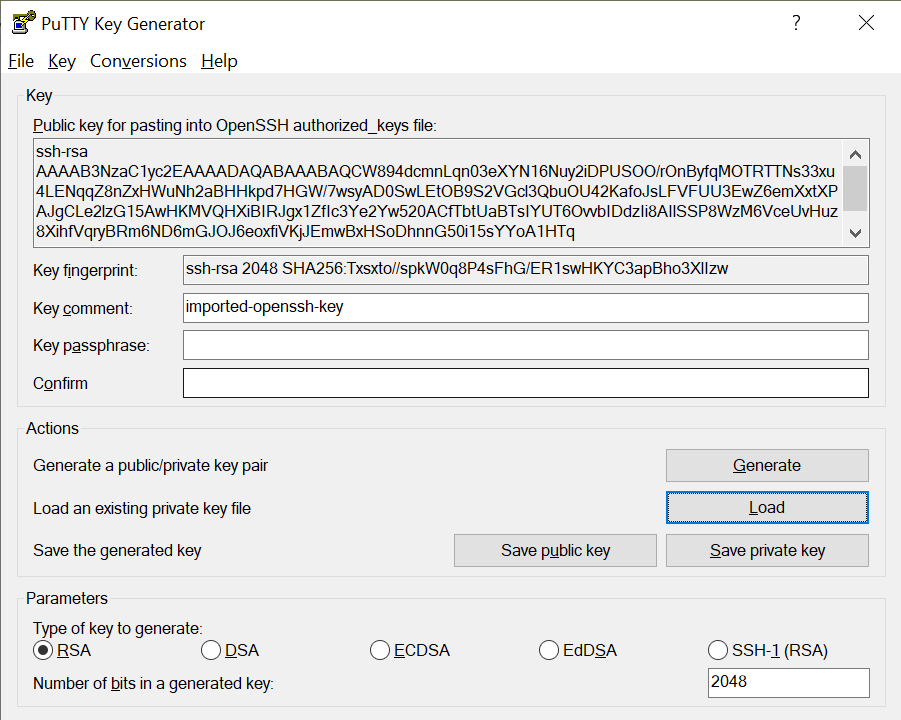
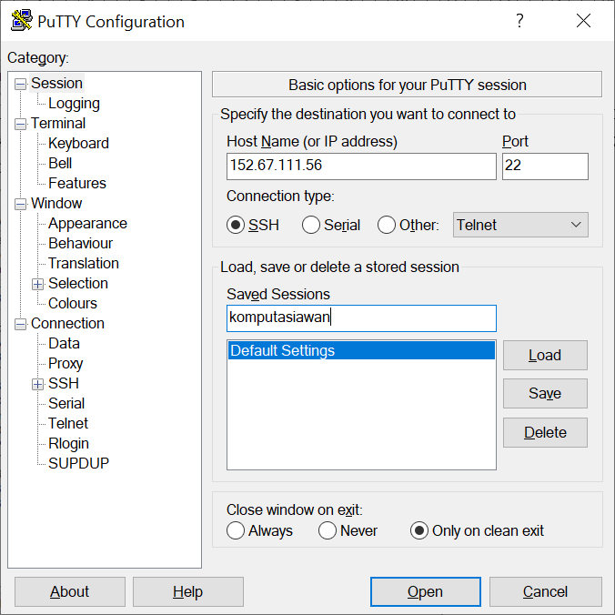
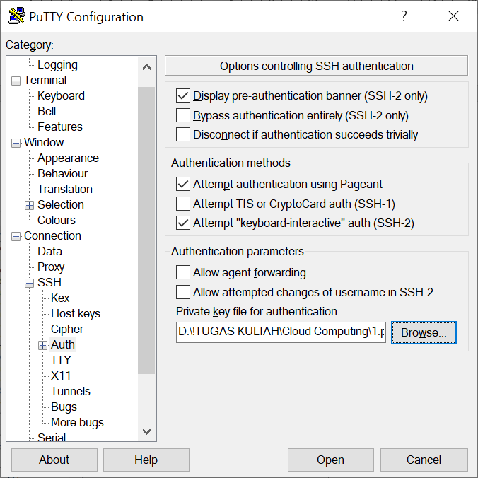
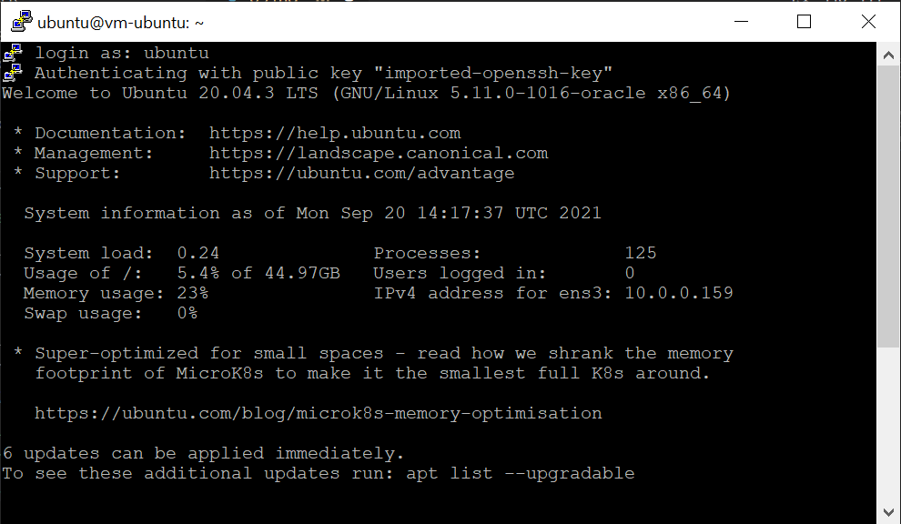

# 03 - Membuat Virtual Machine

## Tujuan Pembelajaran

1. Mengetahui layanan Oracle Cloud Infrastructure Compute
2. Mampu membuat Virtual Machine (VM) di layanan compute Oracle Cloud

## Hasil Praktikum

Berikut ini adalah bukti telah berhasil login ke halaman beranda akun oracle cloud.

Langkah 4

Langkah 5

Langkah 6

Instance sudah terbuat

# Tugas
Carilah cara agar Anda dapat melakukan SSH ke VM yang baru dibuat berdasarkan praktikum tersebut!

1. Membuat file putty key file dengan puttygen. Pilih load dan cari file pirvate key yang sudah di download dari hasil pembuatan instance. Lalu pilih save private key

2. Selanjutnya buka putty untuk menggunakan private key yang sudah di generate menggunakan puttygen.Pada kolom hostname diisi menggunakan ip public dari instance. Dengan port dan koneksi tipe yaitu 22 dan ssh. Dan mengisi saved session, supaya ada save ketika putty keluar.

3. Pada jendela SSH silakan dipilih auth. Lalu tekan tombol browse untuk mengunggah file putty key hasil generate dari puttygen. Setelah selesai tekan tombol open untuk menghubungkan.

4. tampilan ketika sudah terhubung

