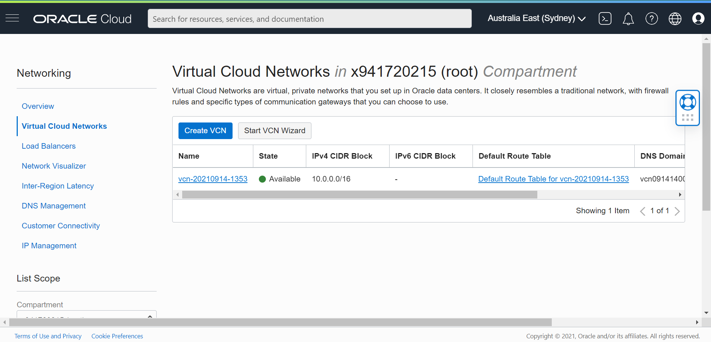
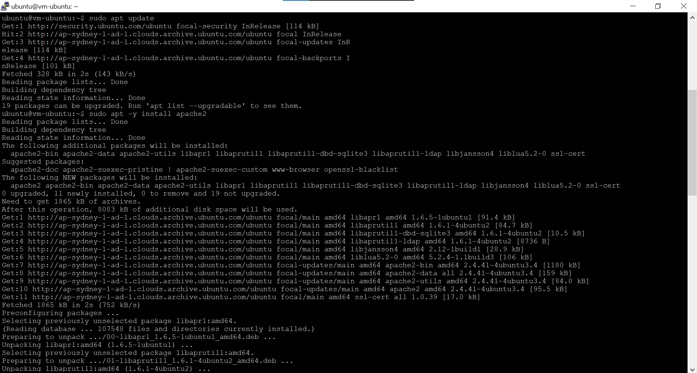
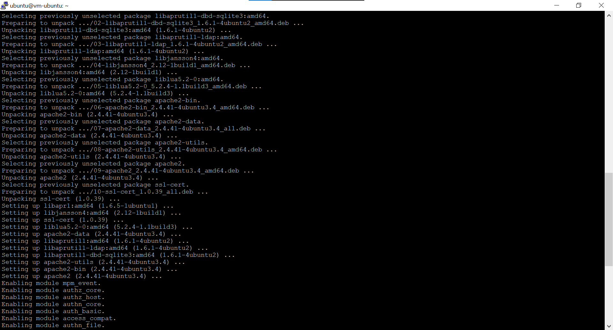
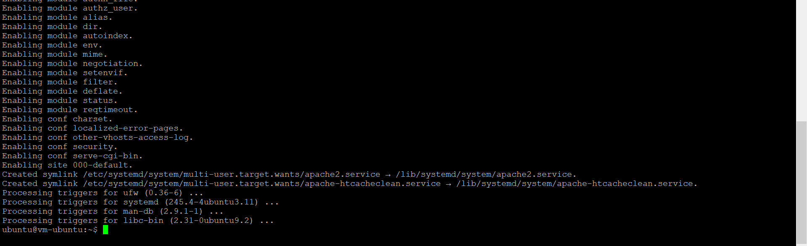
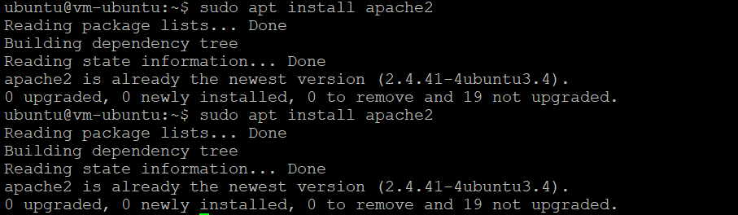
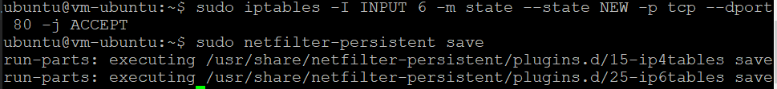
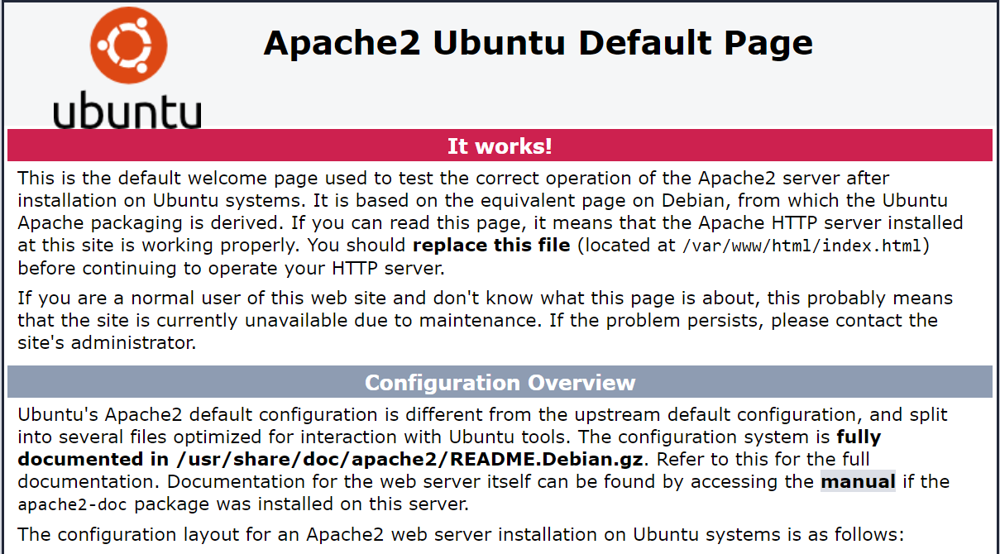

# 04 - Virtual Cloud Network

## Tujuan Pembelajaran
1. Mengetahui layanan Oracle Cloud Infrastructure Networking
2. Mampu mengaktifkan port 80 melalui Virtual Cloud Network (VCN) di layanan
Oracle Cloud
3. Mampu memasang Apache server dan mengonfigurasi IP tables Firewalls

## PRAKTIKUM 1 : Mengaktifkan Port 80 melalui VCN di Oracle Cloud
Langkah 3

Langkah 5

 
## PRAKTIKUM 2 : Setup Apache di VM
Langkah 3

Langkah 4

Langkah 5

Langkah 6

