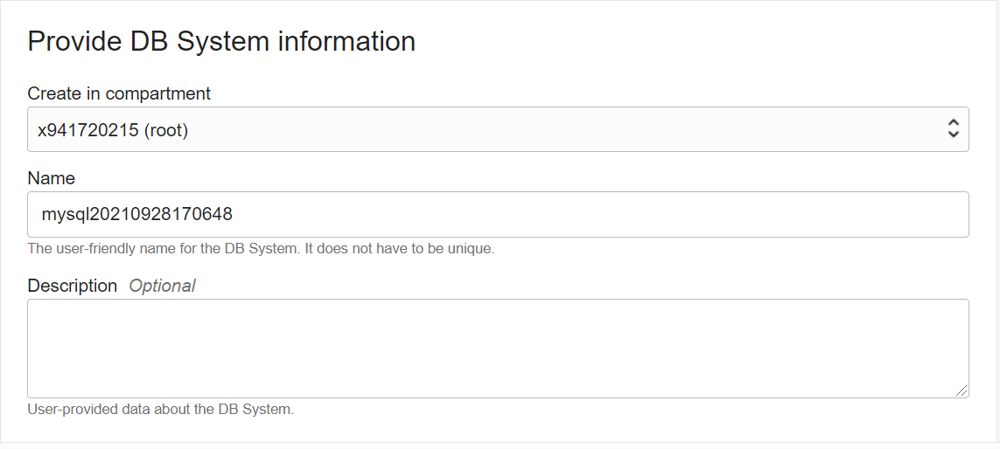
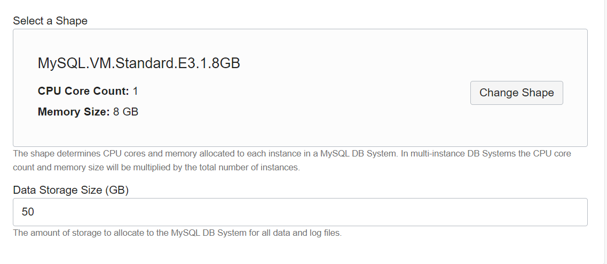
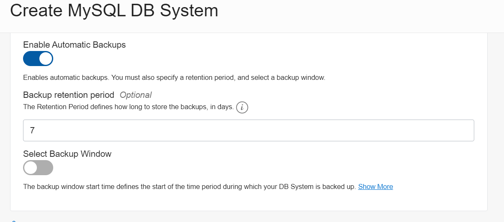
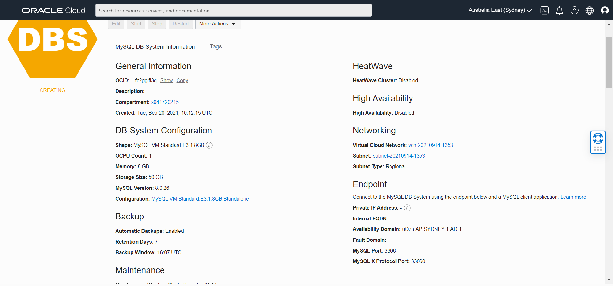
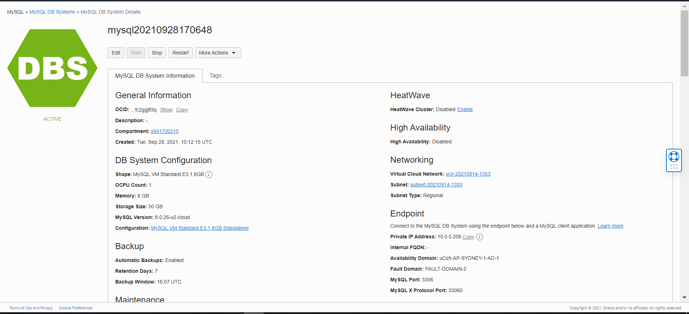
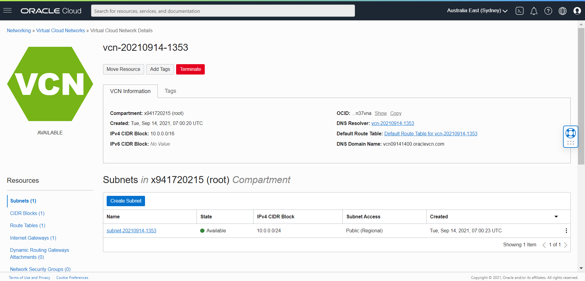
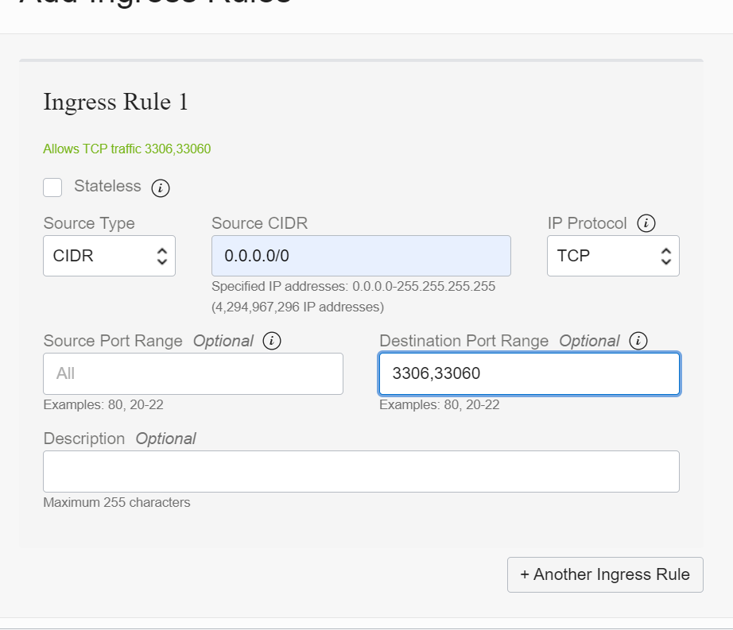
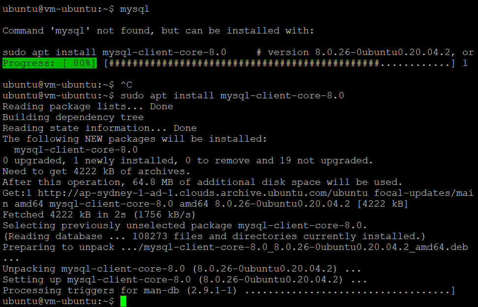

# 05 - PLATFORM AS A SERVICE (PAAS)

## Tujuan Pembelajaran
1. Mengetahui layanan yang ditawarkan cloud computing khususnya Oracle Cloud
Infrastructure (OCI)

## PRAKTIKUM 
Langkah 1 Mengisi Compartment dan Jenis Database

Langkah 2 Mengkofigurasi Shape dari Database

Langkah 3 

Langkah 4

Langkah 5 Database telah dibuat

Langkah 6

Langkah 7

Langkah 8

## TUGAS
