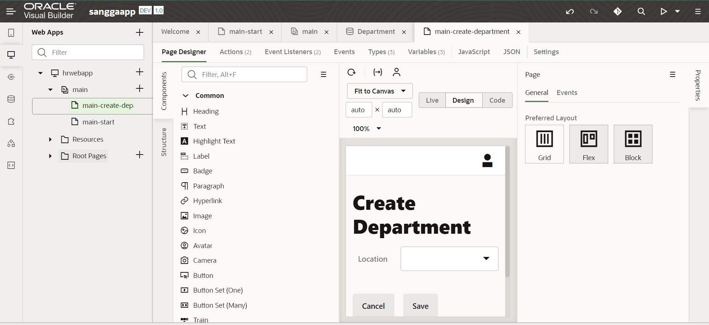

# 05 - SOFTWARE AS A SERVICE (SAAS)

## Tujuan Pembelajaran
1. Mengetahui layanan Oracle Cloud Infrasturcture Software as a Service.
2. Mampu mengguankan layanan software layanan oracle.

## PRAKTIKUM

1. Instance telah dibuat

2. Membuat aplikasi di visual builder

3. Berhasil membuat aplikasi

4. Membuat web dengan “hrwebapp”

5. 

6. 

7. 

8. 

9. 

10. 

11. 

12. 

13. 

14. 

15. 

16. 

17. 

18. setelah di publish

## TUGAS
1. Bussines object salary 

2. Memberikan nama dan harga, centang pilihan Required

3. Membuat table baru dari business object salary

4.	Tampilan utama setelah dibuat

5. Tampilan halaman utama setelah ditambahkan Create, Edit, Detail dan Delete

6. Data dapat di input dengan sukses tanpa kendala
