# 10 - DOCKER

## Tujuan Pembelajaran
1. Mengetahui perbedaan antara virtualisasi dengan container.
2. Mengetahui konsep docker dalam membangun sebuah aplikasi
3. Memanfaatkan container dalam membangun aplikasi
4. Mengetahui perintah dasar docker

## PRAKTIKUM
1. Install docker
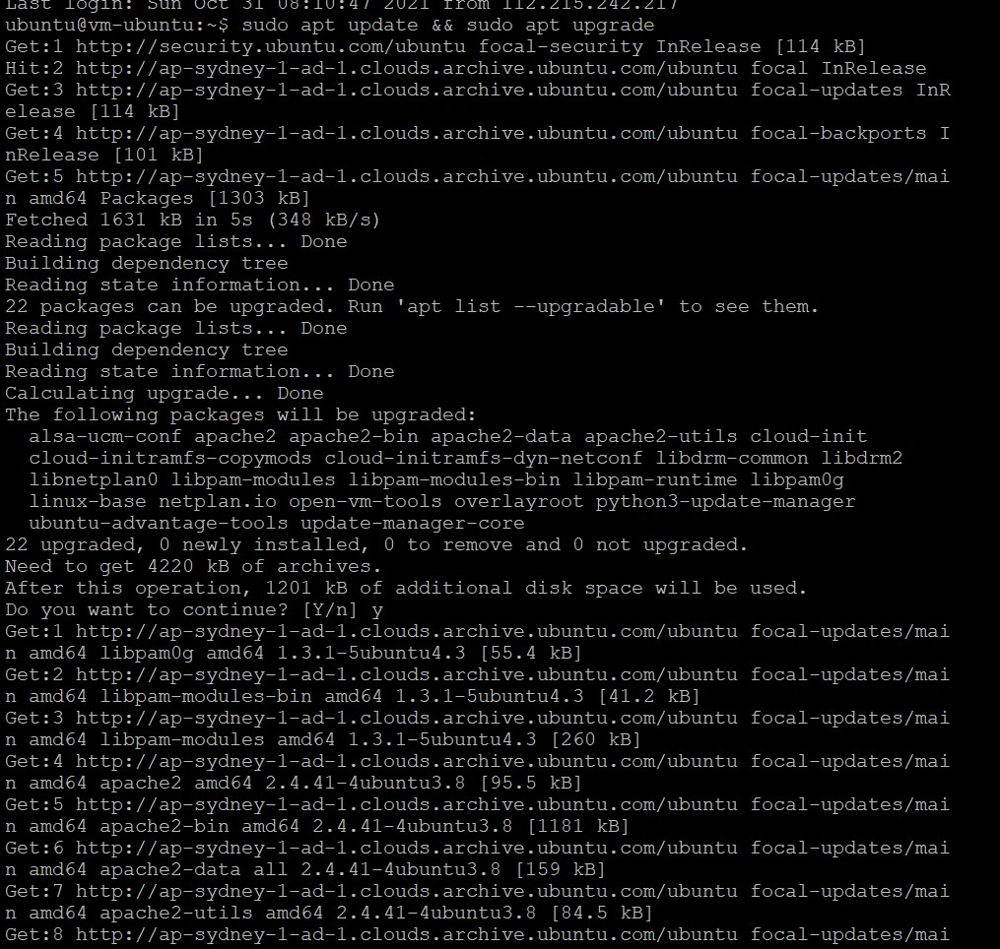

2. Install paket yang dibutuhkan
sudo apt-get install curl apt-transport-https \
➢ ca-certificates software-properties-common
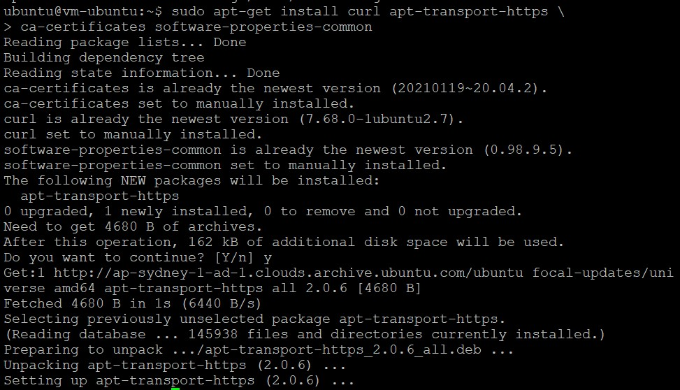
3. Menambahkan repository docker 
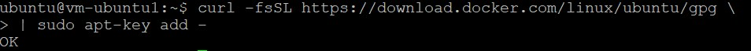

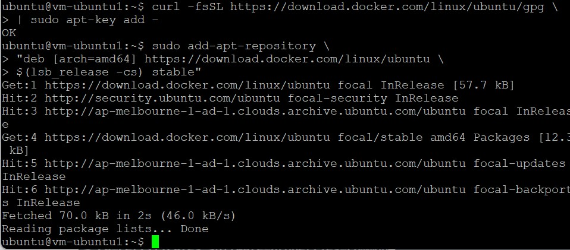

4. Ini menandakan docker belum terinstall dan sudah ada di repository untuk siap
dilakukan installasi
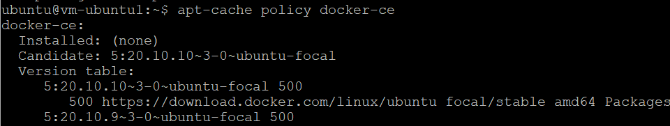

5. menginstall docker
   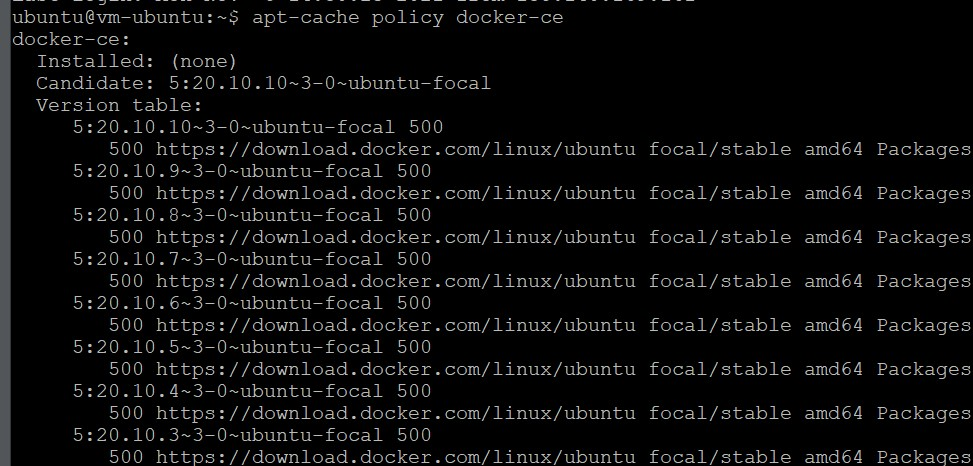
- sudo systemctl status docker
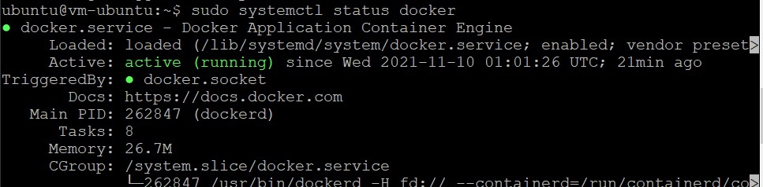
- Docker berhasil berjalan dengan indicator status menampilkan active
(running). Untuk memastikan kembali, docker akan di test apakah benar benar
berjalan semestinya dengan perintah sudo docker run hello-world
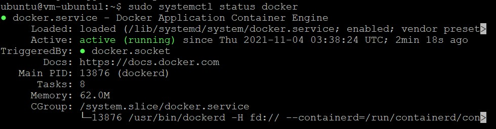
Docker berjalan dengan sempurna dan siap untuk digunakan

6. Membuat user untuk menjalankan perintah docker tanpa menggunakan sudo
- sudo usermod -aG docker $(whoami)
- docker images
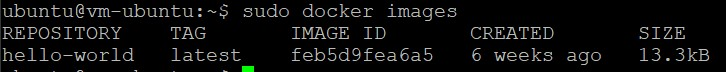

7. Membuat container
 - Installasi web server 
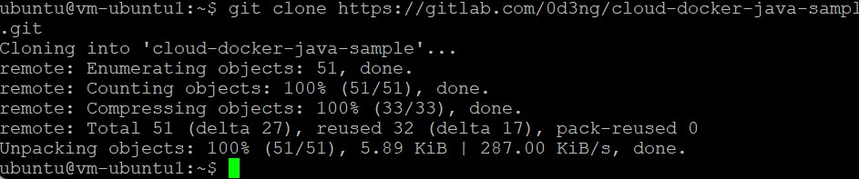

8. Check localhost di telnet degan perintah telnet localhost 8080
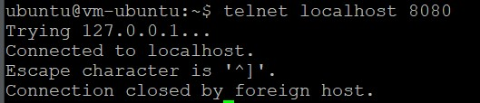

9. Membuat akun Docher Hub
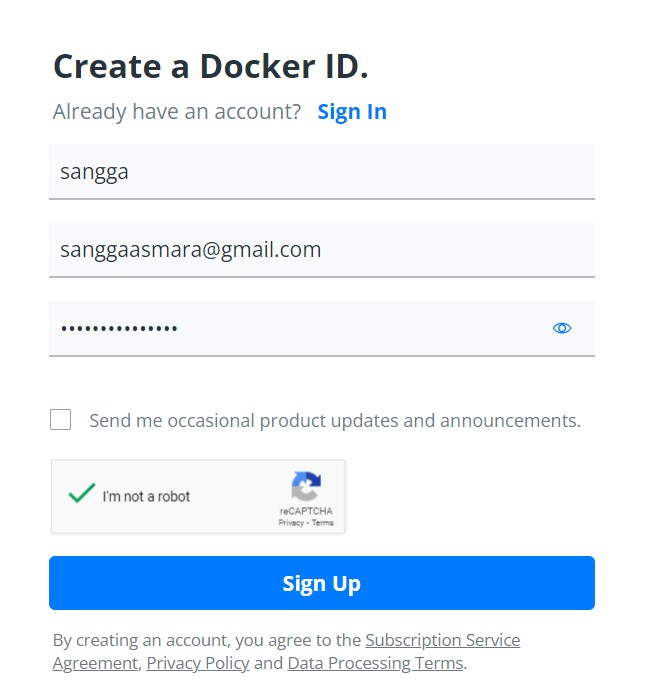

- Berhasil membuat dan masuk

10. Build Image
-  Clone Project https://gitlab.com/0d3ng/cloud-docker-java-sample.git
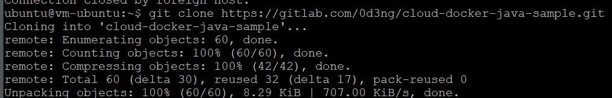

- masuk ke directory cloud-docker-java-sample dengan perintah cd cloud-docker-java-sample 
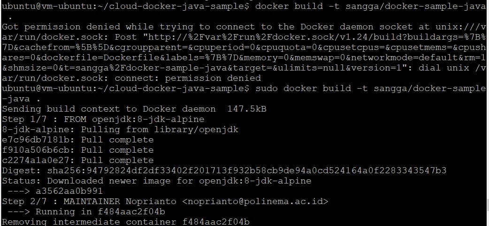

- Jalankan container docker run --name coba-image-java sangga/docker-sample-java:latest
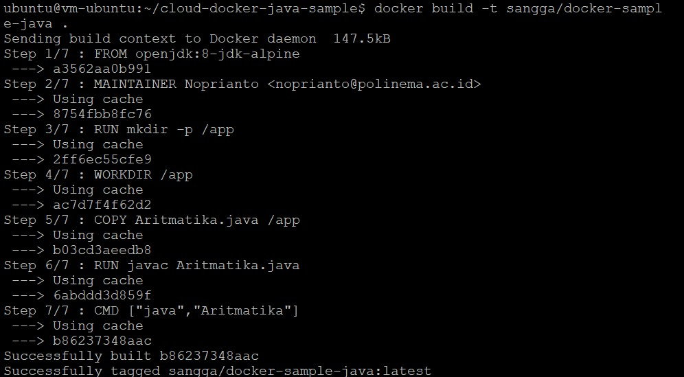

11. Jika kita ingin upload ke docker hub kita, silahkan login dulu menggunakan perintah docker login
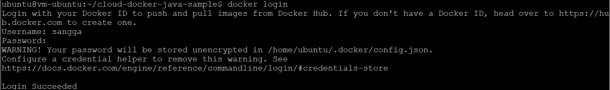

12. Selanjutnya kita upload image yang telah kita buat menggunakan perintah docker push sangga/docker-sample-java
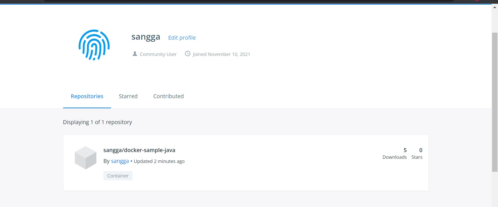

## TUGAS
1. Clone repository https://github.com/sanggaasmara/ucapan-polinema.git
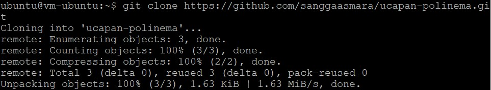

2. 
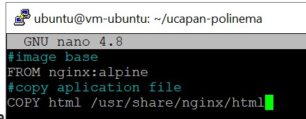

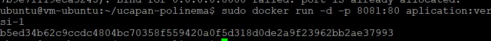

3. hasil run
