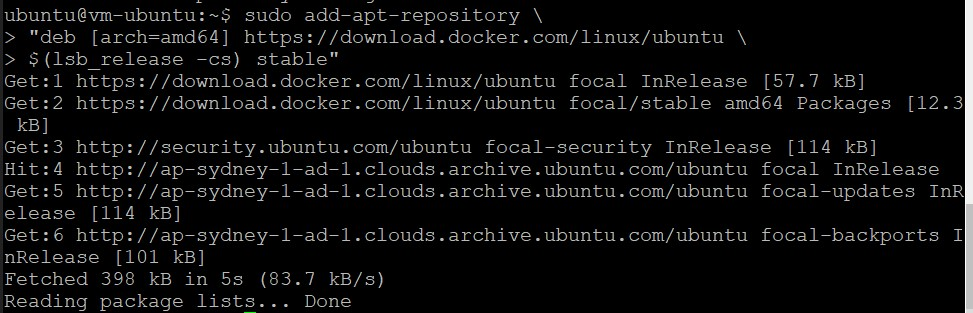
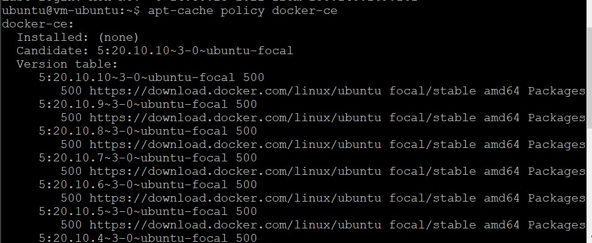
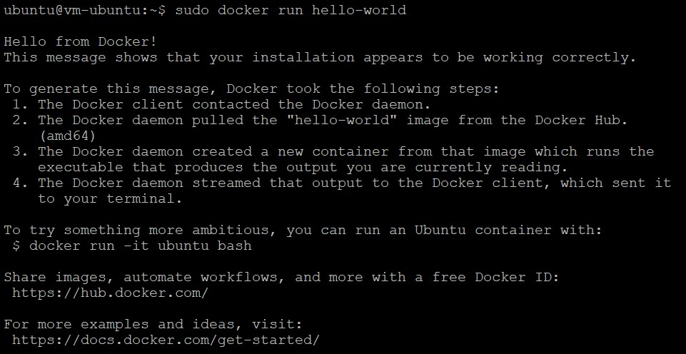

# 10 - DOCKER

## Tujuan Pembelajaran
1. Mengetahui perbedaan antara virtualisasi dengan container.
2. Mengetahui konsep docker dalam membangun sebuah aplikasi
3. Memanfaatkan container dalam membangun aplikasi
4. Mengetahui perintah dasar docker

## PRAKTIKUM
- Install docker
1. 

