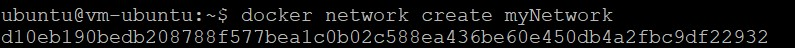
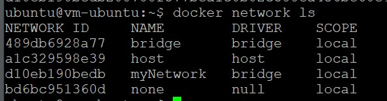
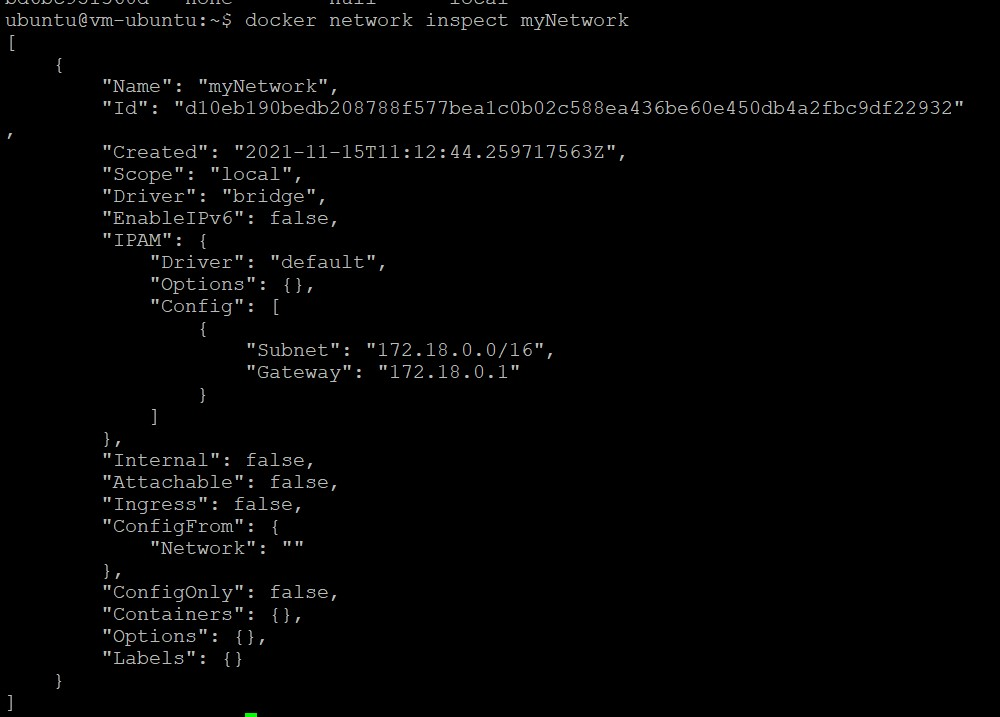
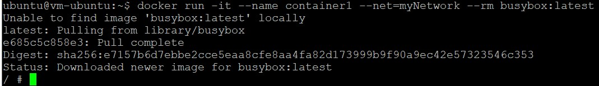
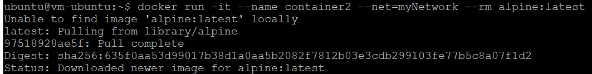
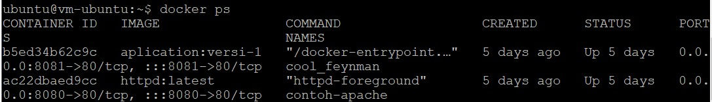
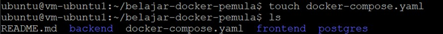
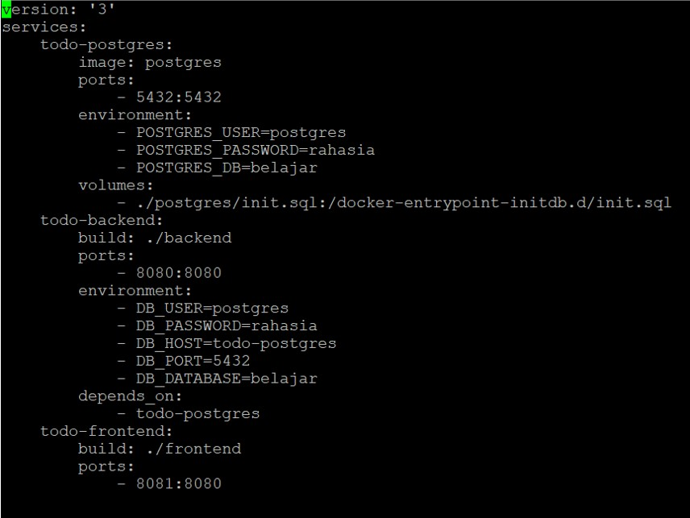
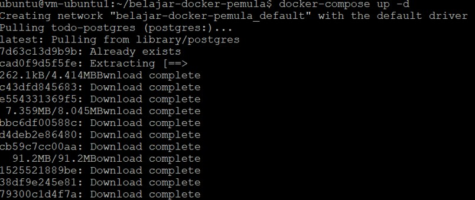
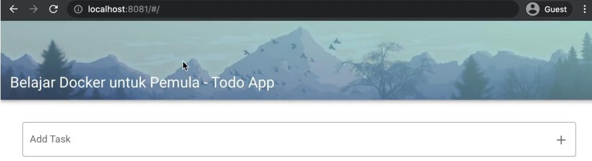

# 11 - DOCKER 2

## Tujuan Pembelajaran
1. Mahasiswa dapat mengetahui secara jelas network di Docker
2. Mahasiswa mengetahui konsep volume pada Docker
3. Mahasiswa mampu memanfaatkan dan menggunakan volume ataupun network ketika build image docker.
4. Mahasiswa bisa menggunakan docker compose dalam pembuatan aplikasi.

## PRAKTIKUM
A. Docker Network

1. docker network create myNetwork

2. docker network ls

3. docker network inspect myNetwork

4. Menghubungkan container ke network dengan Membuat container1 “ docker run -it –name container1 –net=myNetwork
–rm busybox:latest ”

5. Membuat container2 “ docker run -t --name container2 --net=myNetwork -
-rm alpine:latest ”

6. Cek status container yang sedang berjalan dengan “ docker ps ”

## TUGAS

1. 
2. 
3. 
4. 