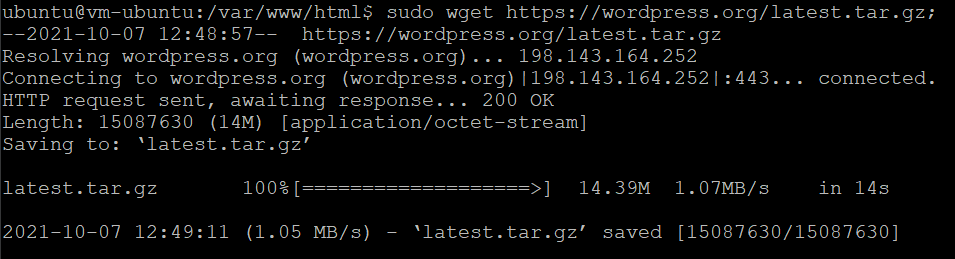

#KUIS 1

1. install mysql client

2. masuk mysql

3. membuat database wordpress

4. mendownload wordpress

5. mengestrak wordpress

6. menginstall php

7. merestart apache

8. pilih bahasa default

9. isi sesuai perintah

10. wordpress siap digunakan
