# 09 - UTS
 Silakan masing-masing individu memanfaatkan object storage sebagai media penyimpanan assets (gambar, file2 upload, dsb) berdasarkan project Kuis 1 kemarin yaitu aplikasi Wordpress.
Sehingga hasil akhir utk UTS aplikasi dpt memanfaatkan VM, DB instance dan Object Storage.

## VIRTUAL MACHINE
Langkah 1

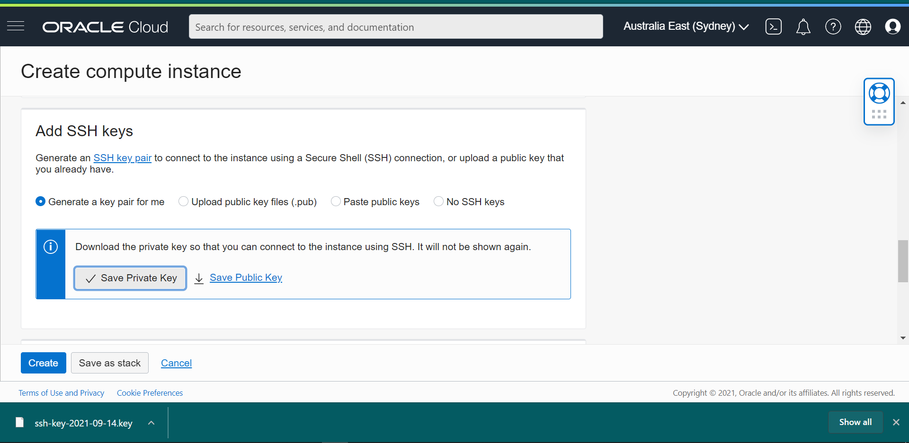

Langkah 2

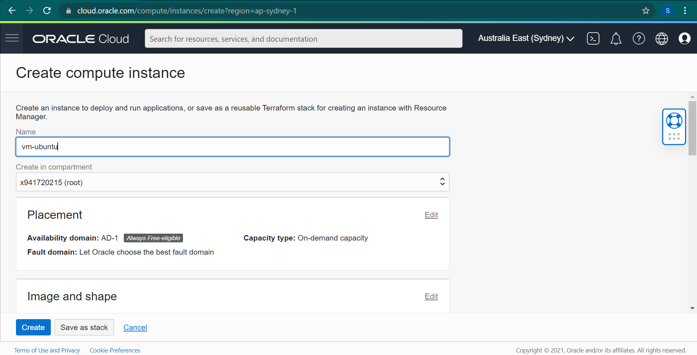

Langkah 3

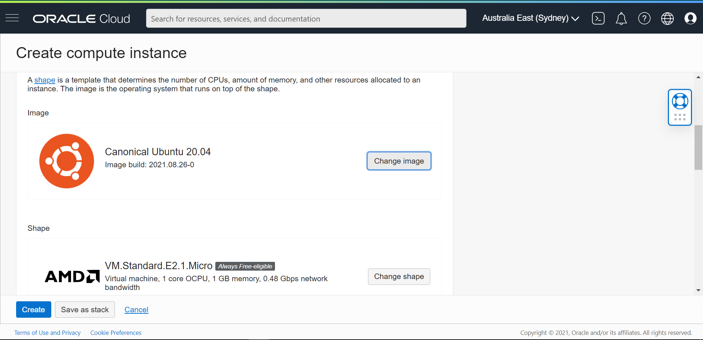

Instance sudah terbuat

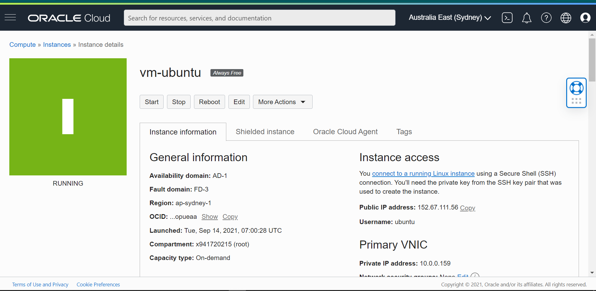

## DB INSTANCE

Langkah 1 Mengisi Compartment dan Jenis Database
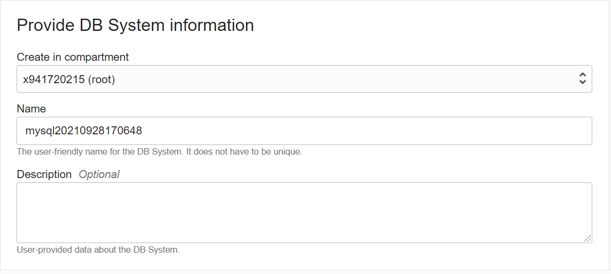

Langkah 2 Mengkofigurasi Shape dari Database
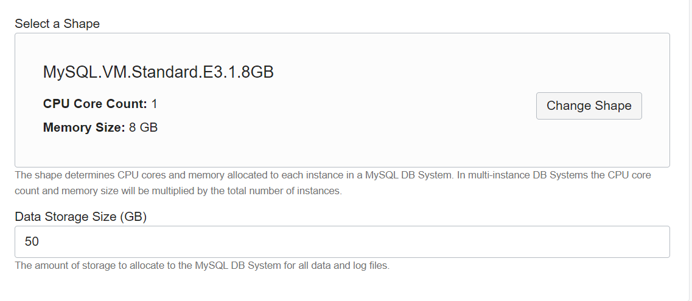

Langkah 3 
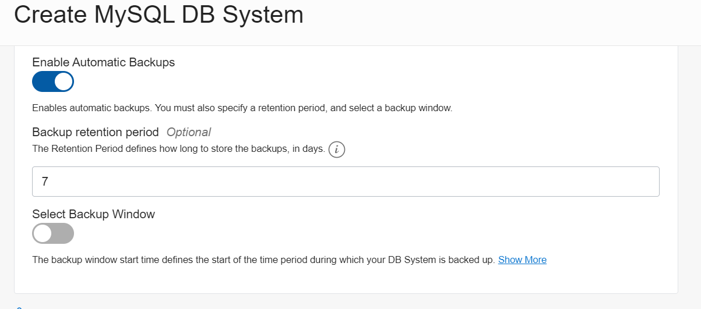

Langkah 4
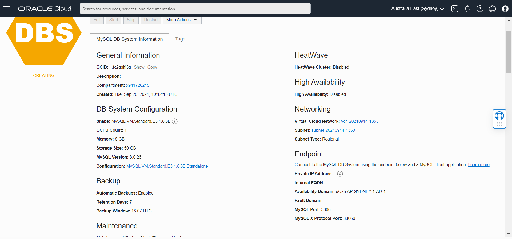

Langkah 5 Database telah dibuat
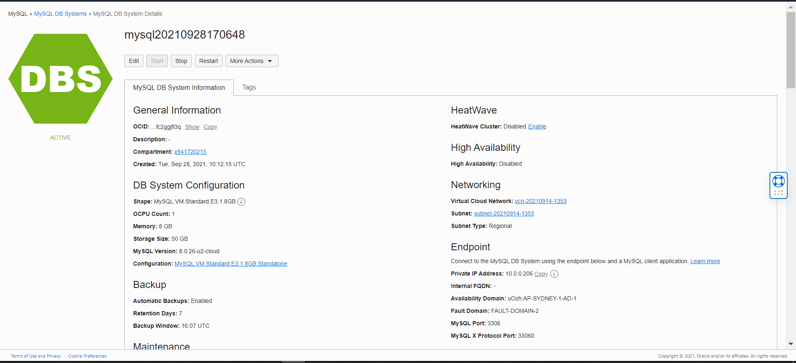

## OBJECT STORAGE
1. membuat bucket
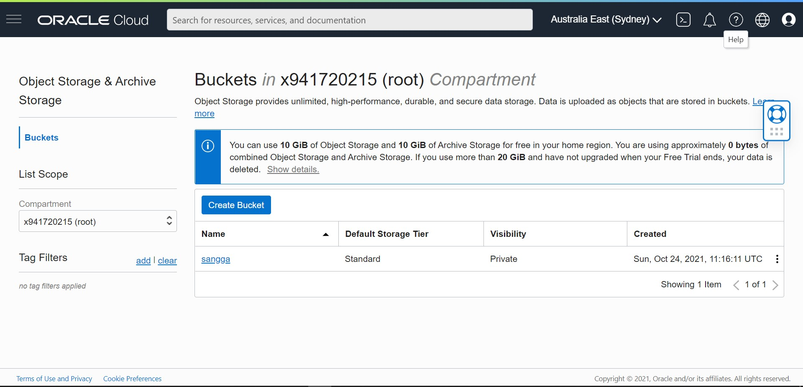

2. Mengubah visibility
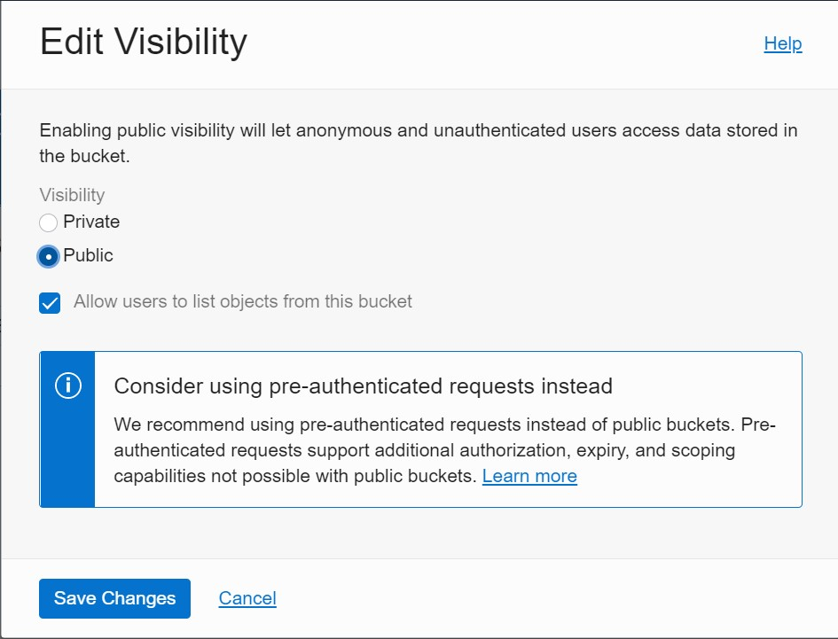

3. Uploading web page
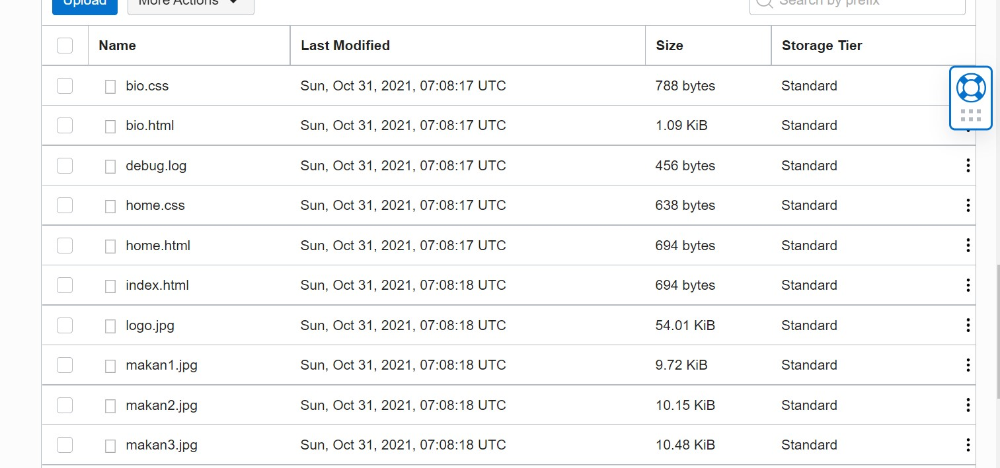

## UTS
Langkah 1
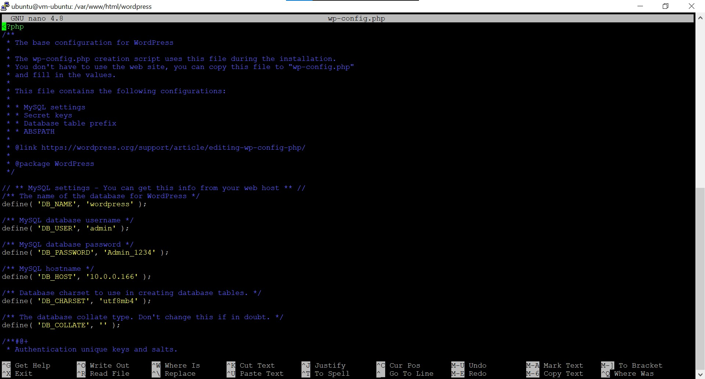

Langkah 2
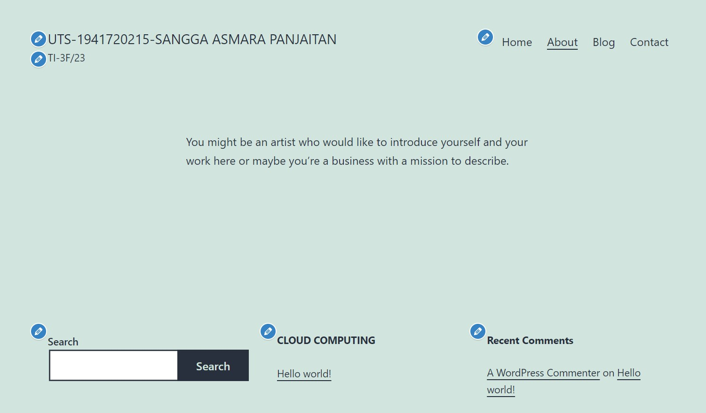

Langkah 3
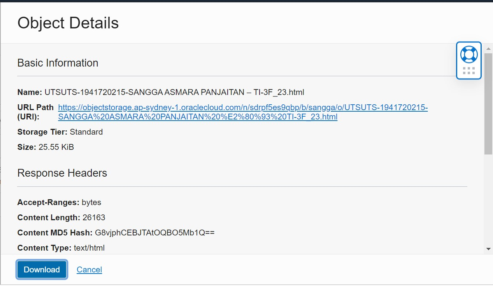

membuat button tampilkan web static
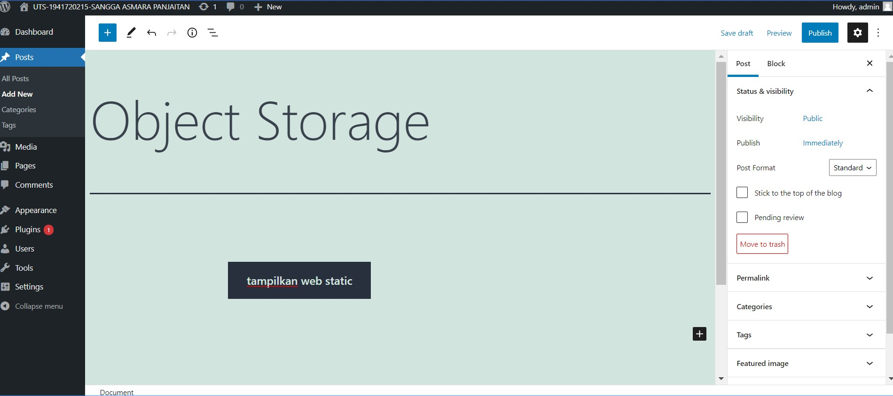

klik tampilkan web static
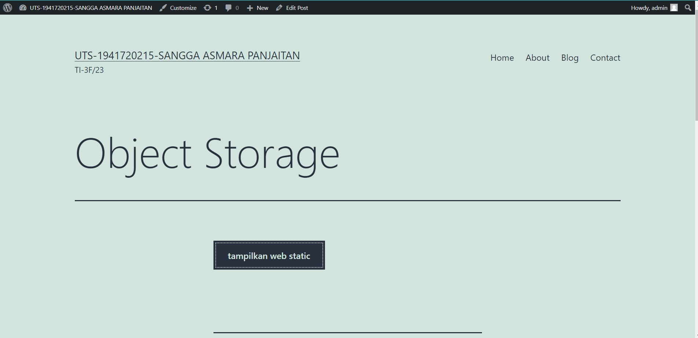

tampilan setelah diklik
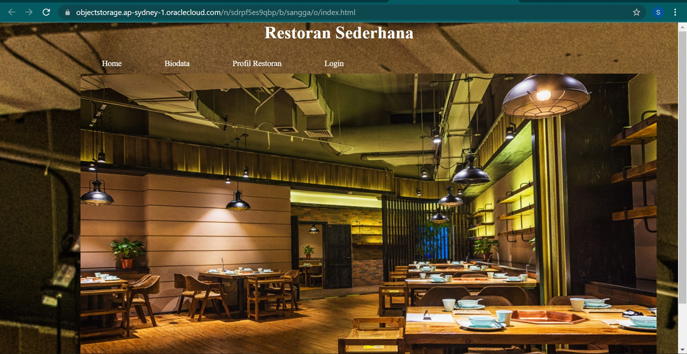

Link Object Storage :http://168.138.100.94/wordpress/index.php/2021/10/31/object-storage/